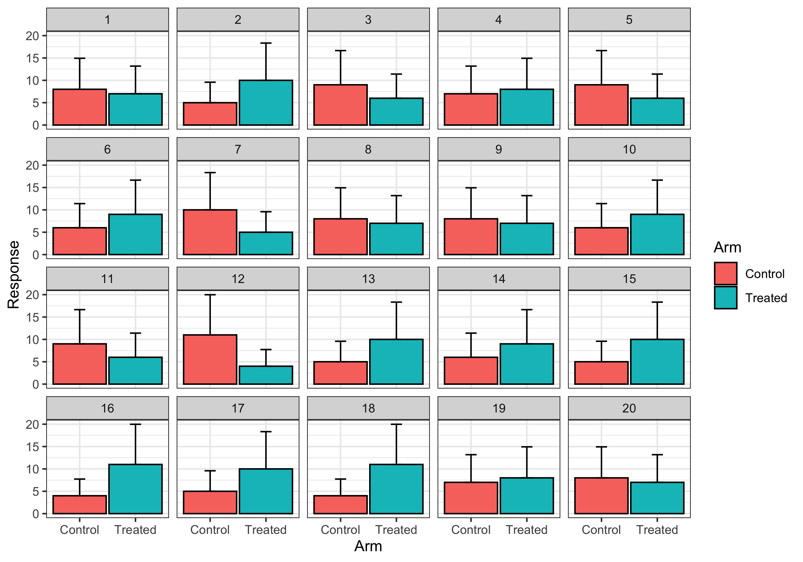

## Overview {#shinytab1}
This module is for analyzing the relationship between a binary exposure (X) and a binary response (Y).
The module creates lineups to visually test the null hypothesis

**The binary outcome (Y) is independent of the binary exposure (X).**

## Lineup Generation {#shinytab2}
To use this module, you should upload a data table with one row per observation and two columns, one for the exposure and one for the response.
Note that the the values in the columns for exposure and response must be 0 or 1.
The module generates null datasets by permuting the entries in the exposure column while keeping the response column fixed.
The module then visualizes each null dataset using a bar graph.

## Examples {#shinytab3}
The vignette dataset contains measurements from a two-arm study to compare response rates to two different dosing regiments.
In the dataset, only 5 out of the 60 patients in the control arm responded while 10 out of the 60 patients in the treated arm responded.
We can use the following lineup to test the null hypothesis that response rate is independent of study arm.

{width=50%}

In this particular example, the original data is shown in Plot 17. 
Notice, however, that Plots 2, 13, and 15 are visually identical to Plot 17.
Although these plots are *identical* to the original plot, the corresponding null *datasets* are not identical.
In fact, while these four datasets all contained 5 respondents in the control group and 10 respondents in the treated group, the datasets differ in terms of *which* subjects responded.

The fact that several null datasets produce identical figures as the original dataset indicates that the observed difference in response rates between the two study arms may not be significantly different.

