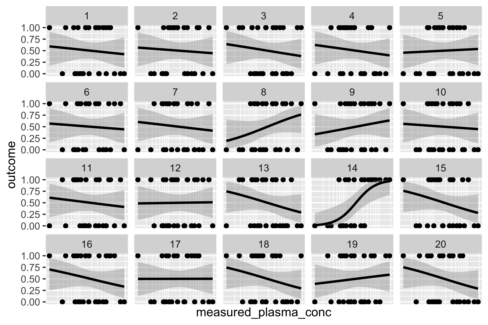

## Overview {#shinytab1}
This module creates a lineup to study the relationship between a continuous exposure and a binary response.
The module tests the null hypothesis

**The binary outcome (Y) is independent of the exposure (X)**

## Lineup generation {#shinytab2}
To use this module, you should upload a data table with one row per observation and two columns, one for the exposure and one for the response.
The module generates null datasets by permuting the entries in the exposure column while keeping the response column fixed.
The module will plot each pair of observed exposure and response.
You can optionally overlay the fitted probability that Y = 1 at every X value, fitted using logistic regression.
You can also optionally visualize the data after log-transforming the exposures (X).

## Example {#shinytab3}
The vignette data were simulated from a logistic regression model in which the increasing the exposure by 1 standard deviation increased the log-odds that Y = 1 by 2.5 units on the log-odds scale.
Uploading these data to the app produced the following lineup plot.

{width=50%}

The real data is plotted in Plot 14.
Since it is quite easy to distinguish Plot 14 from the rest of the plots in the lineup, we may reject the null hypothesis that there is no relationship between the exposure and the outcome.