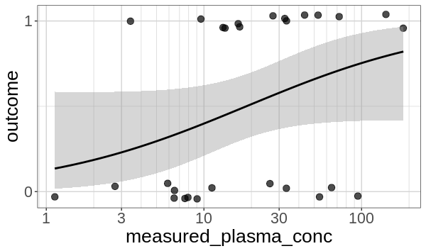

## Overview {#shinytab1}
This tool is intended to help you intuit the significance of your results when you have one binary outcome indicator dependent on a continuous independent variable (eg exposure). Your dataset should contain at least two columns, one numeric biomarker column and one 0/1 binary response column. Information in additional columns will not be used or reflected in a lineup. If this description doesn’t line up with the analysis you are performing, head back to the main menu page to select a different analysis.

Your analysis might lead you to look at a plot that looks like this:

You will upload your data, or explore the preloaded data, and the tool will generate a lineup. If you are able to pick the true data out of a lineup, this suggests the response has a statistically significant dependence on the exposure variable. Contrast this statement to the null hypothesis, 

**The binary outcome (Y) is independent of the exposure (X)**

Note that this visual inference test will not work if you have already visualized your data or have knowledge of where the true points are.

## Lineup Generation {#shinytab2}
One plot in the lineup contains your true data. The remainder of the plots in the lineup contain data that was generated under the null hypothesis:

**Outcome is independent of exposure**

The null plots are generated by a method known as a permutation test - each null plot shows a permutation of the outcome column while the exposure column is held fixed.

The intuition behind the permutation test is that if the outcome is truly independent of exposure, shuffling the outcome values associated with each exposure would give a set of measurements that are just as likely to be produced by the experiment as the input data. If it is difficult to pick your data out of the lineup, you might not have enough evidence to reject the null hypothesis.

## Examples {#shinytab3}
