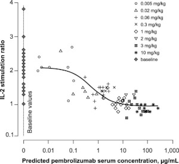
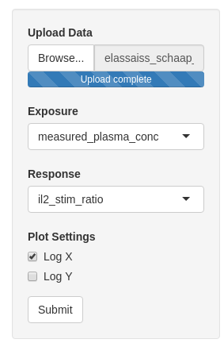
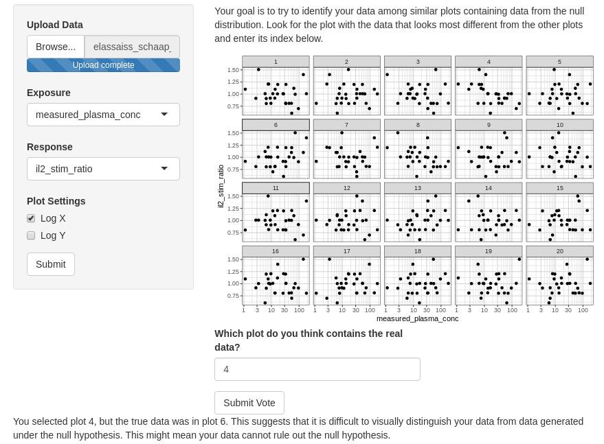

## Overview {#shinytab1}
This tool is intended to help you intuit the significance of your results when you have one continuous dependent variable (eg response) and one continuous independent variable (eg exposure). Your dataset should contain at least two columns, one numeric exposure column and one number response column. Information in additional columns will not be used or reflected in a lineup. If this description doesn’t line up with the analysis you are performing, head back to the main menu page to select a different analysis.

Your analysis might lead you to look at a plot that looks like this:

IL-2 stimulation ratio, a continuous response, as a function of predicted drug serum concentration, a continuous 'exposure', (Elassaiss‐Schaap et al. 2016).

You will upload your data, or explore the preloaded data, and the tool will generate a lineup. If you are able to pick the true data out of a lineup, this suggests the response has a statistically significant dependence on the exposure variable. Contrast this statement to the null hypothesis, 

**The response (Y) is independent of the exposure (X)**

Note that this visual inference test will not work if you have already visualized your data or have knowledge of where the true points are.

## Lineup Generation {#shinytab2}
One plot in the lineup contains your true data. The remainder of the plots in the lineup contain data that was generated under the null hypothesis:

**Response is independent of exposure**

The null plots are generated by a method known as a permutation test - each null plot shows a permutation of the response column while the exposure column is held fixed.

The intuition behind the permutation test is that if the response is truly independent of exposure, shuffling the response values associated with each exposure would give a set of measurements that are just as likely to be produced by the experiment as the input data. If it is difficult to pick your data out of the lineup, you might not have enough evidence to reject the null hypothesis.

## Examples {#shinytab3}
Consider the study in "Using Model‐Based “Learn and Confirm” to Reveal the Pharmacokinetics‐Pharmacodynamics Relationship of Pembrolizumab in the KEYNOTE‐001 Trial" by Elassaiss-Schaap et al., which seeks to determine if pembrolizumab effectively suppresses a patient’s IL2 stimulation ratio.

Assume we have already established efficacy, patients do improve beyond baseline. We are now interested in finding optimal dosing. We might be interested in the question: **do patients with higher drug serum concentrations have better responses?**

To analyze this, we take our data which relates IL2-stimulation ratio to serum concentration, and test the null hypothesis:

**IL2-simtulation ratio is independent of serum concentration**

To test this hypothesis, we use the visual lineup tool to see if we can pick our data out from a lineup of data generated under the null hypothesis (the tool will use a permutation test to do this, see the [learn] page for more).

We will upload the data and register our columns to their meanings. We tell the app that the serum concentration is the exposure and the IL2-stimulation ratio is the response. 

We then generate the lineup and try to pick out the data that looks the most different from the other data.

This ends up being a difficult task, as there doesn’t seem to be a significant difference between the plots. We pick 4, and submit the vote, but the tool explains that this was not the true data. Since we were not able to select our data from the lineup, we might now be more weary of rejecting our null hypothesis. From our visual inference, it seems that increasing measured blood concentration beyond 1 ug/mL doesn’t lead to a significantly better response. This might inform us that 1 ug/mL is near or beyond the dose where response plateaus. 
