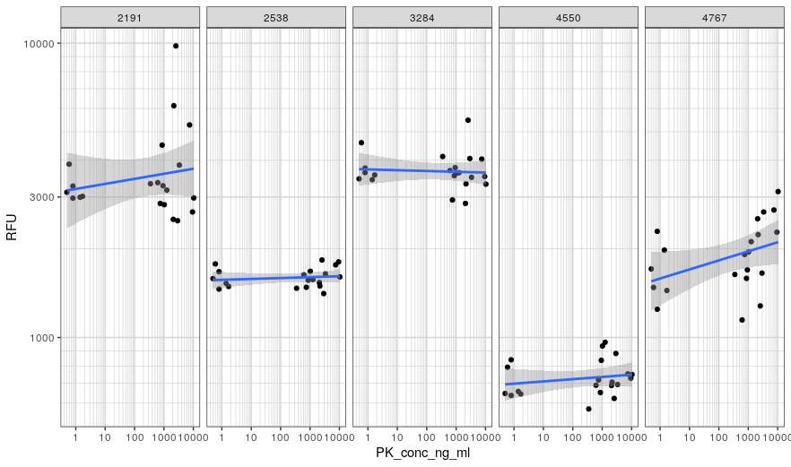

## Overview {#shinytab1}

<b> Note: Since this analysis requires running many linear regressions, it will take a minute or two for the lineup to appear. This is normal. </b>

This tool is intended to help you intuit the significance of your results when you want to determine if you see a significant (slope non-zero) linear correlation between a continuous response and continuous exposure for any subgroup in the context of running a large number of subgroup analyses.

This is an instance of a multiple comparison problem: what might have been a significant result if you only ran one subanalysis may actually be insignificant when you consider that you ran many instances of subanalyses. As the number of subanalyses grows, we can expect more and more "extreme" results, even if the null hypothesis is true. The goal of this lineup is to show you what sorts of "extreme" results you can expect just from running a large number of linear regressions. 

Your dataset should contain at least three columns: a column designating the name of a subgroup/subanalysis, a column containing a continuous independent variable, and a column containing a continuous dependent variable. The analysis will run a linear regression on the exposure against the response for each subgroup indepentently. It will then show the top 5 most extreme regression instances -- that is the five subanalyses that are least likely under the hypothesis that the true slope is zero for each analysis. 

Your analysis might lead you to look at a plot that looks like this:

If this description doesn’t line up with the analysis you are performing, head back to the main menu page to select a different analysis.

## Lineup Generation {#shinytab2}
For this lineup, each row corresponds to an instance of the analysis. Note that this is different from other analysese supported in this app, in which each facet represents a different instance of the analysis. One row corresponds to your true data, the other four rows correspond to permutations of your data. The permutations are generated by permuting the response with respect to the exposure for each subgroup independently. The row is generated by running a linear regression on each subgroup independently, and plotting the most extreme results: subgroups with the lowest p-value for the null hypothesis that the slope of the linear regression is 0.
  