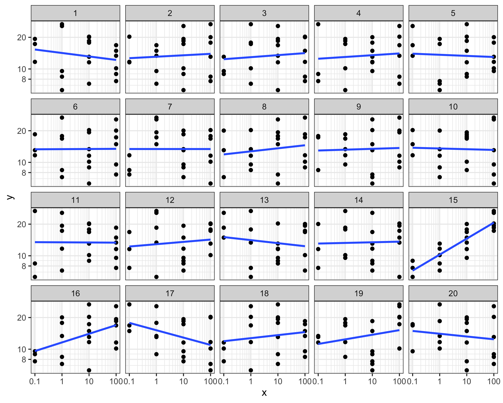

## Overview {#shinytab1}
This module is for analyzing the relationship between a continuous exposure (X) and a continuous outcome (Y).
The module creates lineups to visually test the null hypothesis

**The continuous outcome (Y) is independent of the continuous exposure (X).**

## Lineup Generation {#shinytab2}
To use this module, you should upload a data table with one row per observation and two columns, one for the exposure and one for the response.
The module generates null datasets by permuting the entries in the exposure column while keeping the response column fixed.
The module then visualizes each null dataset using a bar graph.
&nbsp

## Examples {#shinytab3}
The vignette dataset concerns testing for dose-proportionality.
Briefly, if a drug is dose-proportional, we would expect the *dose-normalized response* (defined as the response divided by the dose) to be essentially constant as a function of dose.
To visually check for dose-proportionality, we can create a scatterplot of (log) dose-normalized respones against (log) dose.
We can use the following lineup to test the null of dose-proportionality.

{width=50%}

The real data is plotted in Plot 15, which displays a pronounced increasing trend that is absent in all but one of the other 19 plots.
Although there is also an increasing trend in Plot 16, there is much more variation around the fitted line in that plot that there is in Plot 15.
Since it is quite easy to distinguish Plot 15 from the rest of the plots in the lineup, we may reject the null hypothesis that the drug is dose-proportional.