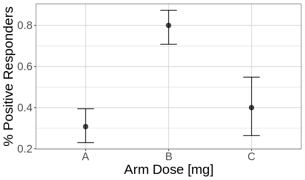

## Overview {#shinytab1}
This tool is intended to help you intuit the significance of your results when you want to determine if multiple subgroups have different occurence rates of a binary outcome. Your dataset should contain at least three columns: a column designating the name of an experimental arm, a column containing the total number of participants in the arm, and a column containing the total number of outcomes of interest. Rows in the input data are aggregated by arm name, and information in additional columns will not be used or reflected in a lineup. If this description doesn’t line up with the analysis you are performing, head back to the main menu page to select a different analysis.

Your analysis might lead you to look at a plot that looks like this:

You will upload your data, or explore the preloaded data, and the tool will generate a lineup. If you are able to pick the true data out of a lineup, this suggests the response has a statistically significant dependence on the exposure variable. Contrast this statement to the null hypothesis, 

**All subgroups have the same occurence rate of the noted outcome.**

Note that this visual inference test will not work if you have already visualized your data or have knowledge of where the true points are. 

## Lineup Generation {#shinytab2}
One plot in the lineup contains your true data. The remainder of the plots in the lineup contain data that was generated under the null hypothesis:

**All subgroups have the same occurence rate of the noted outcome.**

The null plots are generated by a method known as a permutation test - each null plot shows a permutation of the subgroup label of individual units within an arm.

The intuition behind the permutation test is that if the relationship between X and Y is truly independent of the group label, shuffling the group labels associated with each unit would give a set of measurements that are just as likely to be produced by the experiment as the input data. If it is difficult to pick your data out of the lineup, you might not have enough evidence to reject the null hypothesis. 

## Examples {#shinytab3}
