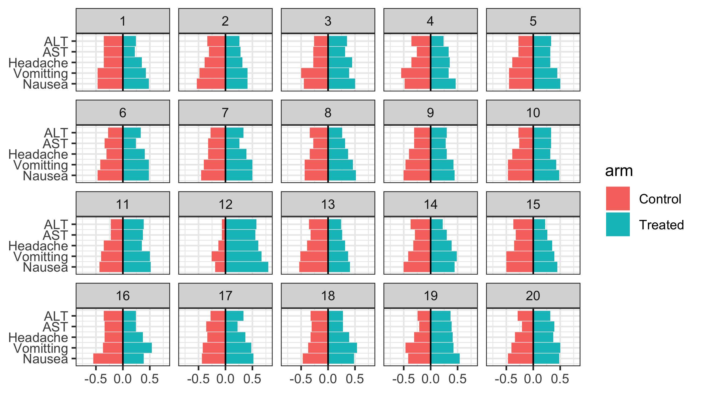

## Overview {#shinytab1}
This module creates tornado plots to compare occurrence rates of multiple adverse events across two treatment arms.
The module tests the null hypothesis

**The occurrence rate of all adverse events is the same in both study arms.**

## Lineup Generation {#shinytab2}

The rows of the data table should corresponding to individual patients in the study.
There should be should a column indicating to which study arm each patient was assigned (0 for control, 1 for treated).
It should also contain a column for the occurrence (1) or non-occurrence (0) of each adverse event.
The module creates null datasets by permuting the arm assignment column while keeping all of the other columns fixed.

## Examples {#shinytab3}
The vignette considers a synthetic dataset that simulates the occurrence of five adverse events in a small trial with 62 control and 54 treated patients.
In the control group, the probabilities of the adverse events were 0.2, 0.15, 0.15, 0.1, and 0.05.
The probabilities of adverse events for the treated group were 0.6, 0.55, 0.55, 0.5, and 0.45 (i.e. 40 percentage points higher than controls).
We can use the following lineup to test the null hypothesis.

{width=50%}

The original data is in Plot 12, which is extremely asymmetric: the bars for the treated group's occurrence rates are noticeably larger than the bars for the control group. 
In the remaining plots, the bars are much better balanced between treated and control groups.