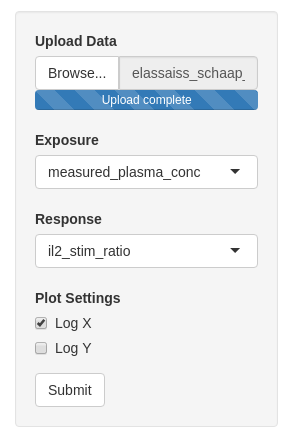
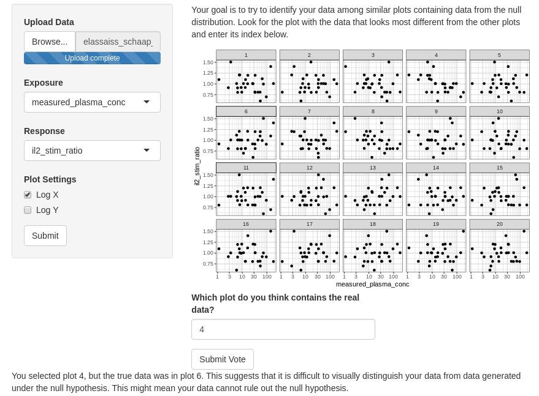

## Data Upload + Lineup Voting {#shinytab1}

Consider the study in "Using Model‐Based “Learn and Confirm” to Reveal the Pharmacokinetics‐Pharmacodynamics Relationship of Pembrolizumab in the KEYNOTE‐001 Trial" by Elassaiss-Schaap et al., which seeks to determine if pembrolizumab effectively suppresses a patient’s IL2 stimulation ratio.

Assume we have already established efficacy, patients do improve beyond baseline. We are now interested in finding optimal dosing. We might be interested in the question: **do patients with higher drug serum concentrations have better responses?**

To analyze this, we take our data which relates IL2-stimulation ratio to serum concentration, and test the null hypothesis:

**IL2-simtulation ratio is independent of serum concentration**

To test this hypothesis, we use the visual lineup tool to see if we can pick our data out from a lineup of data generated under the null hypothesis (the tool will use a permutation test to do this, see the [learn] page for more).

We will upload the data and register our columns to their meanings. We tell the app that the serum concentration is the exposure and the IL2-stimulation ratio is the response. 

We then generate the lineup and try to pick out the data that looks the most different from the other data.

This ends up being a difficult task, as there doesn’t seem to be a significant difference between the plots. We pick 4, and submit the vote, but the tool explains that this was not the true data. Since we were not able to select our data from the lineup, we might now be more weary of rejecting our null hypothesis. From our visual inference, it seems that increasing measured blood concentration beyond 1 ug/mL doesn’t lead to a significantly better response. This might inform us that 1 ug/mL is near or beyond the dose where response plateaus. 

## Team Voting {#shinytab2}

1. One user uploads the data and configures the settings as if they were generating a lineup for themselves.
2. After the settings are input, the user clicks "Download Analysis Setup". Note this button only appears after data has been uploaded.
3. The user can distribute this .Rdata configuration file to team members. This file contains the data, so team members should not explore the flie.
4. Other team members navigate to the appropriate analysis and select "Upload Shared Analysis" at the top of the settings file.
5. Uploading the configuration file will create a lineup which the team member will then vote on and get feedback on the correctness of their vote.
6. The counts of total and correct votes are collected from the team and entered into the in-app calculator to get a "see"-value.